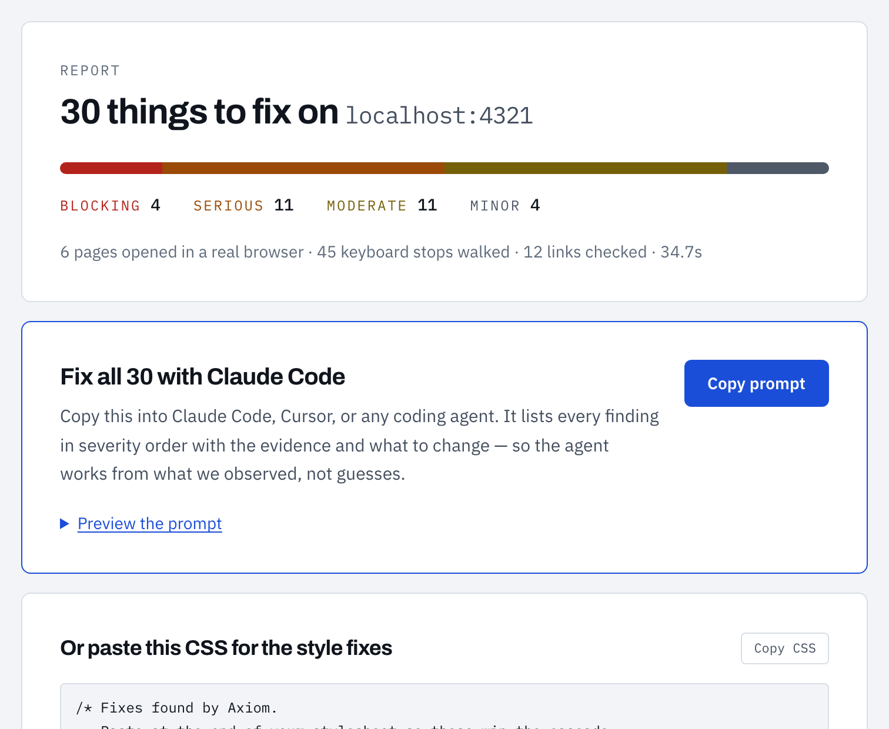

# Axiom

**Find what's broken before you ship it.**



> A real run against the bundled demo site (`npm run fixture`) — 6 pages opened in a
> real browser, 45 keyboard stops walked, 12 links checked, in 35 seconds.

**[Live demo](https://hack1-lemon.vercel.app)** · the code audit runs fully in the
browser demo. The live-site audit drives a real Chromium browser, so it needs a
container — run it locally for the full experience:

```bash
git clone https://github.com/thesurajgupta/axiom && cd axiom
npm install && npx playwright install chromium
npm run fixture   # in one terminal — the deliberately broken demo site
npm run dev       # in another
```

Axiom is two audits in one.

**Point it at a URL** and it crawls your whole site, opens every page in a real
browser, and *actually uses it* — pressing Tab through each screen, requesting
every link, rendering everything on a phone.

**Or give it your source** and it reads the code for the security bugs AI coding
assistants ship constantly: hardcoded API keys, SQL built by string
concatenation, login routes with no rate limiting, payment amounts trusted from
the client. This half runs entirely on your machine — the code never leaves it.

Both end the same way: plain-language findings, and the prompt that fixes them.

```
30 things to fix on nimbus.app
████████░░░░░░░░░░░░░░░░░░░░░░  4 blocking · 11 serious · 11 moderate · 4 minor
6 pages opened in a real browser · 45 keyboard stops walked · 12 links checked

01  2 controls cannot be reached by keyboard                     BLOCKING
    We pressed Tab through the entire page and never landed on these.

    <div>  "Sign up free"  — has a click handler but is not a button or link
    Where:  /  ·  /pricing

    Fix:  <div onClick={...}>  →  <button onClick={...}>

                                          [ Copy prompt for Claude Code ]
```

---

## The problem

People ship software faster than they can check it.

An app gets built in an afternoon. It works when you click around, so it goes
live — with no security headers, cookies anyone can read, an API returning 500s
on load, six internal links pointing at pages that never existed, a pricing table
that scrolls sideways on a phone, and a sign-up button keyboard users can never
press.

None of that is visible from the outside unless you go looking. Checking it by
hand across five concerns and every page takes a day, and nobody has a day.

## What Axiom checks

| | |
| --- | --- |
| **What broke** | Uncaught exceptions, your own APIs returning 5xx, files that 404 |
| **Whether a keyboard works** | Controls nobody can reach, invisible focus, dead ends, illogical tab order |
| **Every link on the site** | We request each one. Internal 404s and dead outbound links, with the page that links to them |
| **How it behaves on a phone** | Re-rendered at 390px: horizontal overflow, tap targets under 24px, text under 12px |
| **What the server gives away** | Security headers, cookie flags, publicly downloadable `.env` files and source maps, HTTP that never redirects to HTTPS, mixed content |
| **What you forgot** | No meta description, no share preview, no sitemap, still `noindex` from staging |
| **How slow it is** | First paint, page weight, missing compression |

Then it produces **one prompt** containing every finding, in severity order,
with the evidence and the fix — ready to paste into Claude Code, Cursor, or any
coding agent.

## What Axiom does *not* check, and why

Anything that requires attacking a server: rate limits, authentication bypass,
payment logic, SQL injection.

Testing those means sending hostile traffic at a host you may not own. It is
unreliable from the outside and, in most jurisdictions, illegal. Any tool
claiming to find "all your security vulnerabilities" from a URL alone is either
reading response headers and calling it security, or doing something you should
not point at a server you do not own.

Axiom only reads what a page and its server volunteer to an ordinary browser.
Everything it reports, it observed.

---

## The part that is actually novel

Static analysers read your DOM and check it against rules. That is how axe,
Lighthouse and every scanner in this category work, and it catches mechanical
faults — a missing `alt`, a failing contrast ratio.

It structurally **cannot** catch the failures that actually lock people out:

- a button you can never reach because it is a `<div>` with a click handler
- focus that enters a modal and can never leave
- a focus ring someone removed because it looked untidy
- a pricing table that is 900px wide on a 390px phone
- a link that has pointed at a deleted page for two years

None of those are visible in markup. You find them by *operating the site the
way somebody with no mouse, on a phone, actually operates it*.

So Axiom does that. It presses Tab, records every stop, and compares what it
reached against everything on the page that behaves like a control:

```
2 controls cannot be reached by keyboard                      BLOCKING

  We pressed Tab through the entire page and never landed on these.

  <div>  "Sign up free"  — has a click handler but is not a button or link
  <span> "Dismiss"       — has role="button" but no tabindex

  Where:  /  ·  /pricing
```

That is a finding no scanner produces, because producing it requires using the
site rather than reading it.

---

## The code audit: real security bugs, the legal way

You cannot test for SQL injection or a missing auth check by attacking a live
server — and you should never point an attack tool at a host you do not own. But
you do not have to. With the source, you *read* the vulnerability directly. That
is static analysis (SAST), and it is what real tools do.

Axiom's code scanner finds, among others:

| Category | What it catches |
| --- | --- |
| **Secrets** | AWS/Stripe/OpenAI/Anthropic/Google/GitHub keys, private keys, DB URLs with passwords, committed `.env` — every value **masked** in the report |
| **Injection** | SQL built by concatenation, shell command injection, `eval`, `dangerouslySetInnerHTML`, path traversal, open redirect |
| **Auth** | Login/signup/reset routes with no rate limiting, JWT decoded without verifying the signature, MD5/SHA-1 password hashing |
| **Payment** | Charge amount trusted from the client, Stripe webhooks handled without signature verification |
| **Config** | TLS verification disabled, wildcard CORS with credentials, debug mode on, raw errors returned to the client |
| **Dependencies** | Non-registry installs, missing lockfile, install scripts, `.env` not git-ignored |

It is honest about being heuristic: every finding says what shape it *detected*,
not that it is proven exploitable. A pattern scanner's job is to put a human's
eyes on the twelve lines that deserve them.

### Trust is the whole product here

You are handing a security tool your source, so the privacy model is not fine
print:

- **Local CLI (zero upload):** `npm run audit -- ./your-project` runs entirely on
  your machine. The code never leaves it, and the scanner makes no network calls.
- **Web upload:** the archive is unzipped and scanned **in memory** and then
  discarded — never written to disk, never stored, never logged, never sent to
  any third party or model.
- **Secrets are masked everywhere.** A found key shows as `sk_live_••••••7a4`
  with its `file:line`, never the value. A tool that prints your live keys to a
  screen you are sharing is the opposite of one.

Validated against a deliberately vulnerable fixture (`npm run audit:demo`):

```
19 findings · 6 files scanned · 9 blocking · 5 serious · 4 moderate · 1 minor
```

It catches the hardcoded Stripe key, the concatenated SQL, the `jwt.decode`, the
client-trusted payment amount, the login route with no rate limiter, the
`.env` in git, and more — each with a masked evidence line and a fix.

---

## Results

**Against a deliberately broken app** (`npm run fixture`) — six pages of faults
we have each seen on real deployed sites:

```
30 findings · 6 pages · 12 links checked · 45 keyboard stops · 35.8s
4 blocking · 11 serious · 11 moderate · 4 minor
```

It finds the exposed `.env` with the Stripe key, the 500 from its own API, the
uncaught exception, the unreachable sign-up button, five dead internal links, a
dead outbound link, and the pricing table that overflows on mobile.

**Against w3.org** — the people who wrote the specification:

```
10 findings · 5 pages · 140 links checked · 222 keyboard stops · 52.5s
0 blocking · 2 serious · 5 moderate · 3 minor
```

Zero blockers, as you would hope. Getting this number right mattered more than
getting it high: two false positives showed up on the first run against w3.org
(a 1×1px skip link reported as an undersized tap target, and an `<iframe>`
reported as missing a focus indicator) and both are now filtered, because a tool
that cries wolf on a careful site is worse than no tool.

**Against itself** — Axiom audits Axiom in CI. It found 8 real problems in its
own interface (no CSP, no `X-Frame-Options`, no Open Graph tags, no `robots.txt`,
`x-powered-by` disclosure, and an 11px label its own mobile check flagged) and
every one is fixed in this repo.

---

## Running it

```bash
npm install
npx playwright install chromium
npm run dev
```

Open <http://localhost:3000> and paste any public URL.

| Command | What it does |
| --- | --- |
| `npm run dev` | Start the app |
| `npm run scan -- <url>` | Full site audit from the terminal |
| `npm run scan -- <url> --page` | Single page only |
| `npm run scan -- <url> --max=50` | Raise the page cap |
| `npm run fixture` | Serve the deliberately broken demo site on :4321 |
| `npm run audit -- <path>` | Audit local source for security bugs (nothing leaves your machine) |
| `npm run audit:demo` | Audit the deliberately vulnerable fixture project |
| `npm run test:contrast` | Assert the WCAG maths against reference values |
| `npm run verify:palette` | Assert Axiom's own palette clears AA in both themes |

---

## How it is built

```
   URL
    │
    ▼
 crawl ─── same-origin, robots.txt honoured, concurrency-limited,
    │      page-capped and time-budgeted
    ▼
 for each page:
 ┌──────────────┬─────────────┬────────────┬──────────────┬─────────────┐
 │   runtime    │   launch    │ performance│ accessibility│   mobile    │
 │ console/net  │ meta, lang  │  timings   │  axe + KEYS  │   at 390px  │
 └──────────────┴─────────────┴────────────┴──────────────┴─────────────┘
    │
    ├─ once per site: headers, cookies, .env, source maps, HTTPS, robots
    ├─ across the site: every link requested
    ▼
 merge by root cause  →  sort by consequence  →  agent prompt
```

**Two browser contexts, and the reason matters.** Injecting an audit harness
requires bypassing the site's Content Security Policy — but bypassing CSP also
suppresses the failures the policy itself causes. A site whose CSP blocks its own
scripts looks perfectly healthy through a bypassed browser. So pass one loads
each page under its *real* policy to observe runtime behaviour, and only pass two
bypasses CSP to inject axe and drive the keyboard. We found this by running Axiom
on Axiom: the single-pass version reported our own site clean while a console
error sat in the browser.

**Findings merge by root cause.** The same faint grey appears on every page
sharing a stylesheet. That is one problem with forty symptoms, so it is reported
once, with the list of pages — not forty times.

**Contrast fixes are computed, not generated.** WCAG defines relative luminance
as a pure function of sRGB, so the minimal correction can be *solved for*. Axiom
binary-searches lightness in HSL space for the smallest shift that clears the
threshold while preserving hue — `#777777` on white becomes `#767676`, the
canonical minimum-passing grey, at a 0.4% shift. No API key, no model call, same
answer every run.

**Refusing to fix is a first-class outcome.** Axiom will not invent alt text for
an image it cannot see. A plausible-sounding `alt` silences the audit while lying
to the screen-reader user it was meant to help.

## Crawling politely

Same origin only. `robots.txt` `Disallow` rules are honoured, and the parser errs
toward *not* crawling when a rule is ambiguous. Concurrency is capped at three
pages, link checking at six requests, HEAD is preferred over GET, and both a page
cap and a wall-clock budget bound the run. We are auditing a site on its owner's
behalf, not load-testing it.

## Axiom's own accessibility

A tool that fails its own audit has no standing. Skip link, semantic landmarks,
`aria-live` on the streaming log, a real progress bar, visible focus on every
control, `prefers-reduced-motion` honoured, and both themes with **every**
foreground/background pair asserted against WCAG AA by the same solver that
powers the product (`npm run verify:palette`).

## Limitations

- **The audit sees rendered pages, not your repo.** Selectors are hints for where
  to look, which is why the agent prompt says so explicitly.
- **Pages behind a login are not reached.** The crawler has no credentials, by
  design.
- **Forms are not submitted.** Axiom never sends data to your endpoints.
- **Some sites refuse automated browsers** or exceed the navigation timeout. The
  error is surfaced, not swallowed.
- **Automated rules cover roughly a third of WCAG.** Axiom makes that third solid
  and says plainly what still needs a person.

## Stack

Next.js 16 · TypeScript · Tailwind v4 · Playwright · axe-core · fflate
(in-memory unzip) · Server-Sent Events. No database, no API keys, no external
model calls. The code audit makes no network calls at all.
